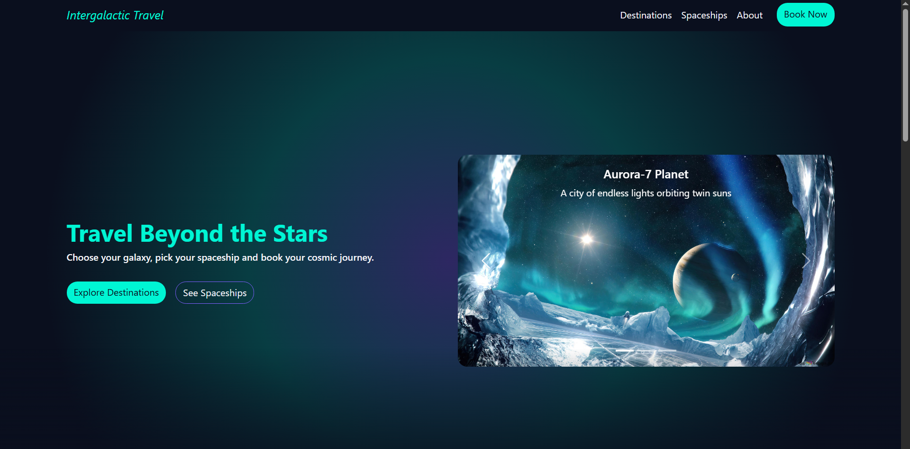
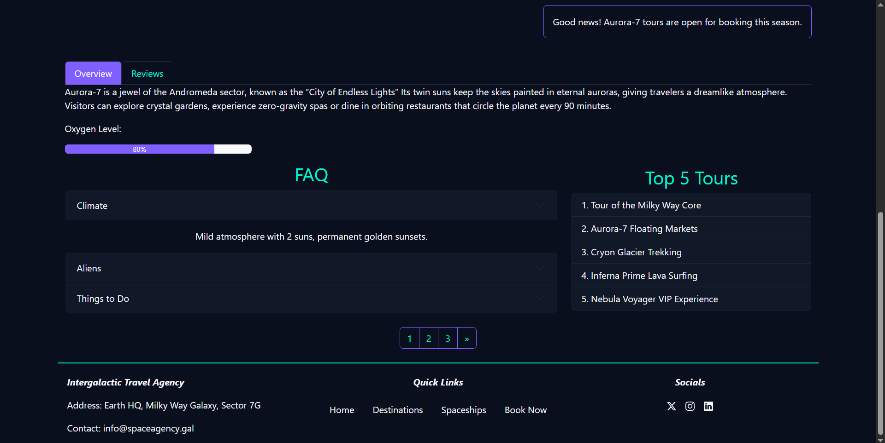

# Intergalactic Travel

Explore the universe, one planet at a time.

This project is a fully responsive, Bootstrap website that takes you through the stars with destinations like Aurora 7, Cryon and Inferna Prime. Built with clean code and custom cosmic theming. It’s a perfect mix of design, functionality and imagination.

## Features

- Responsive Design: Works seamlessly on desktop, tablet, and mobile.

- Custom Cosmic Theme: Neon Cyan, Cosmic Purple, and Star White palette.

- Bootstrap 5 main components.

- Planet Details Pages: Overview, reviews, tours, and FAQs for each destination.

- Smooth Navigation: Breadcrumbs and pagination for intuitive exploration.

## Preview




## Project Structure

```
.
├── index.html
├── aurora.html
├── cryon.html
├── inferna.html
├── css/
│   └── bootstrap.min.css
    └── custom-styles.css
├── img/
├── js/
├── preview/
└── README.md
```

## UI/UX

- Headings: Neon Cyan (#00F5FF).

- Highlights & Buttons: Cosmic Purple (#7F5FFF).

- Body Text: Star White (#F3F4F6).

- Backgrounds: Deep Space Navy (#0A0F1E).

## How to Run

```
git clone https://github.com/YourUsername/interstellar-travel-agency.git

```
